# 💇‍♂️ Hair Salon Booking Application

This is a full-stack web application for a hair salon, featuring client booking and admin management.

---
## 💇‍♀️ About This Hair Salon Booking App

Welcome to the **Hair Salon Booking Application**, a modern, responsive web app that lets clients browse services, book appointments, and gives salon staff an admin dashboard to manage everything end-to-end.

### 🛠️ Technologies & Libraries
- **Frontend:**  
  - React.js (CRA)  
  - Bootstrap 5 for layout, components & responsive design  
- **Backend:**  
  - Node.js + Express.js  
  - MongoDB with Mongoose ORM  
- **Tooling & Scripts:**  
  - `npm run start-all` to install, seed DB, and launch both frontend (3000) & backend (5000)  
  - Environment variables via `backend/.env` 
  - More detail on ho to set up given below 

### 📄 Pages & Features

| Page / Section       | Description                                                                          |
|----------------------|--------------------------------------------------------------------------------------|
| **Home**             | Hero banner, featured services, “Book Now” call-to-action.                            |
| **Services**         | List of all salon services (cuts, coloring, styling) with descriptions, durations & prices. |
| **Booking Form**     | Step-by-step form for choosing service, date/time & entering client details.         |
| **Admin Dashboard**  | Protected area where staff can:  
  1. **View/Edit** all appointments  
  2. **CRUD** salon services  
  3. **Manage** client records  
  4. **See** daily/weekly calendar at a glance |

### 🔑 Admin Credentials

> **Username:** `admin`  
> **Password:** `admin123`

> _(To go to admin page go to http://localhost:3000/admin/login)_

---

Feel free to customize styles, add more pages (e.g. “About Us”, “Contact”), or hook up real email/SMS reminders. Enjoy building your salon’s online presence!

---

## 📋 Prerequisites

You’ll need the following installed:

### 1. Node.js & npm
- **Download:** [Node.js Official Website](https://nodejs.org/en) (LTS version recommended)
- **Verify Installation:**
```bash
$ node -v
$ npm -v
```

### 2. MongoDB
- **Download:** [MongoDB Community Server](https://www.mongodb.com/try/download/community)
- **Installation Guides:**
  - Windows: [Install on Windows](https://www.mongodb.com/docs/manual/tutorial/install-mongodb-on-windows/)
  - Linux: [Install on Linux](https://www.mongodb.com/docs/manual/administration/install-on-linux/)
- **Start MongoDB:**

Windows (PowerShell; if installed as a service, it may already be running)
```powershell
PS> net start MongoDB
```
Linux
```bash
$ sudo systemctl start mongod
```

- **Verify the Mongo Shell:**
```bash
$ mongosh
# (type `exit` then Enter to quit)
```

---

## 🚀 How to Get Started

### 1. Clone the Repository

Open your terminal preferable in VS code and run:

* Windows (Powershell)
```bash
#replace this path with any folder directory you like
PS> cd C:\Users\YourUser\Documents\Projects
PS> git clone https://github.com/MIbrahimPro/Simple-Hair-Salon-Website-using-Mern.git
```

* Linux/macOS
```bash
#replace this path with any folder directory you like
$ cd ~/Projects
$ git clone https://github.com/MIbrahimPro/Simple-Hair-Salon-Website-using-Mern.git
```

### 2. Navigate to the Project Folder

Windows (PowerShell)
```bash
PS> cd Simple-Hair-Salon-Website-using-Mern
```

Linux/macOS
```bash
$ cd Simple-Hair-Salon-Website-using-Mern
```


### 3. Start the Application

From the project root, run:

```bash
$ npm run start-all
```
This script will:
  1. Check/create backend/.env with defaults
  2. Install all dependencies (frontend + backend)
  3. Seed the database (services, appointments, admin)
  4. Launch backend (http://localhost:5000) and frontend (http://localhost:3000)


- **Frontend:** http://localhost:3000  
- **Backend API:** http://localhost:5000  


To stop the servers, press **Ctrl + C** (you may need to press it twice).

---
## 📸 Screenshots

===

<h3>Home Page</h3>
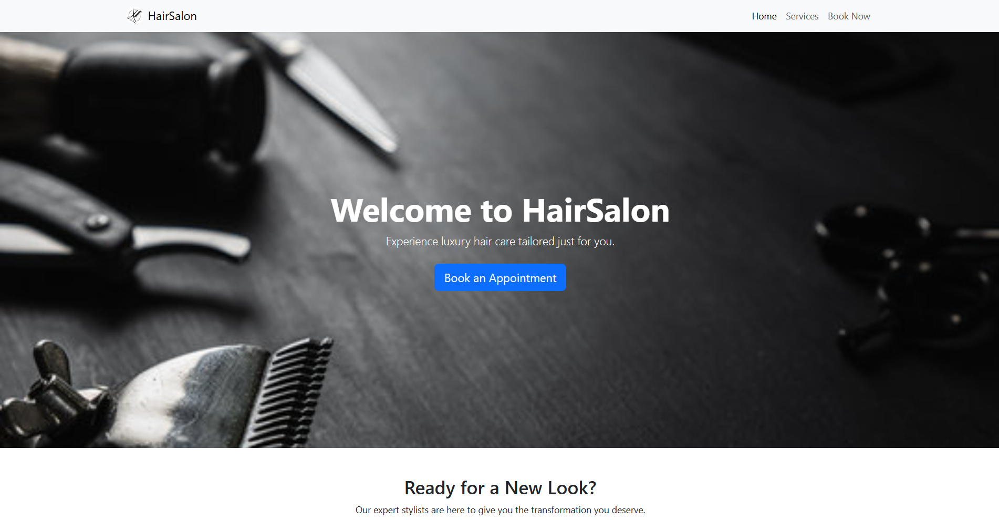<br />
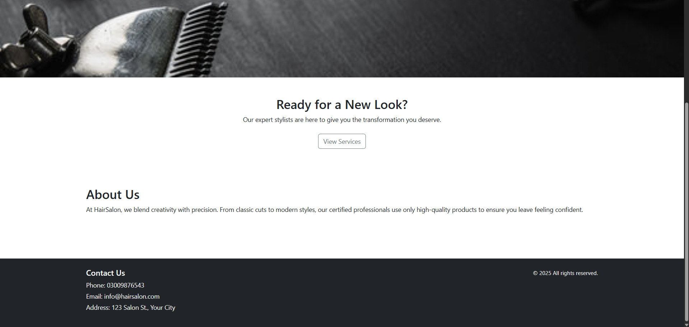<br />
<br />
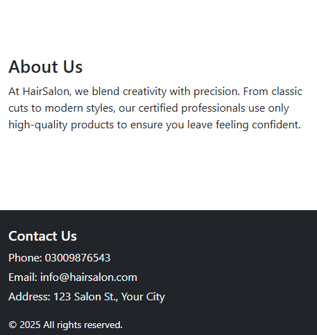<br />

<h3>Services Page</h3>
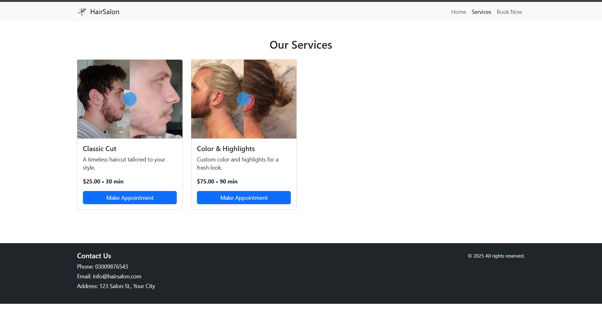<br />
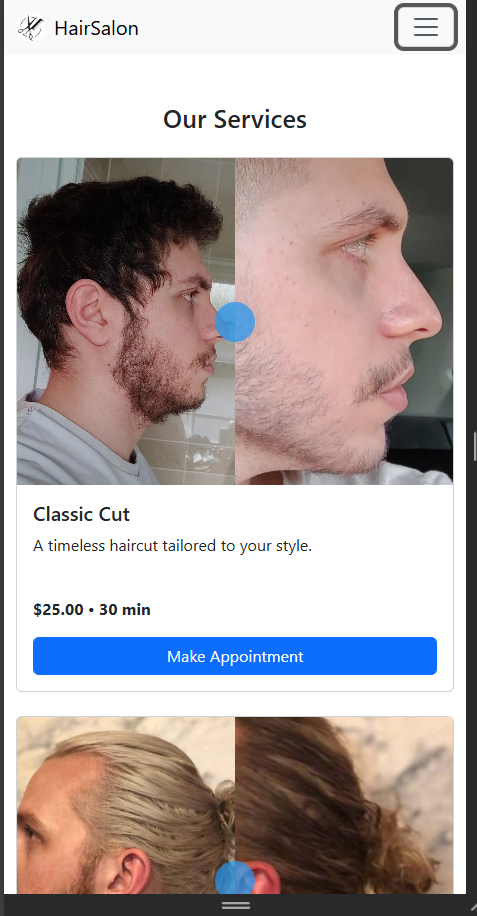<br />

<h3>Booking/Appointment form Page</h3>
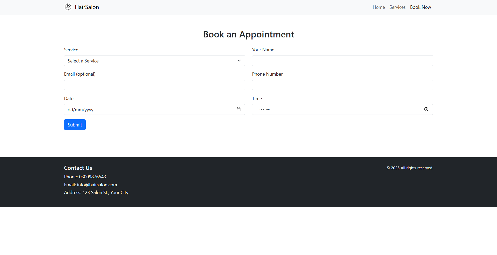<br />
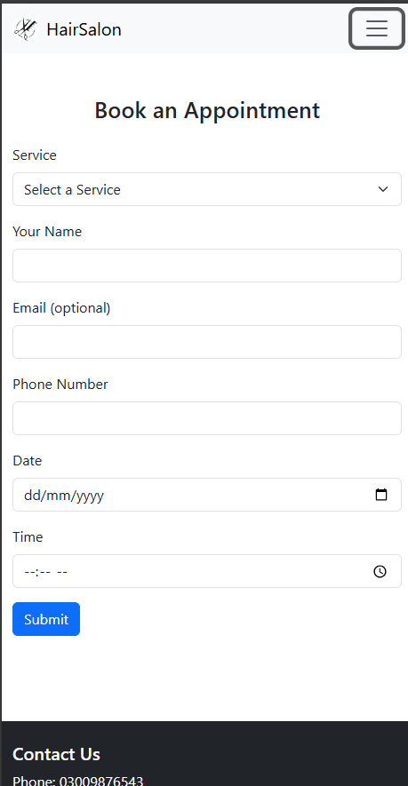<br />

<h3>Admin Pages</h3>
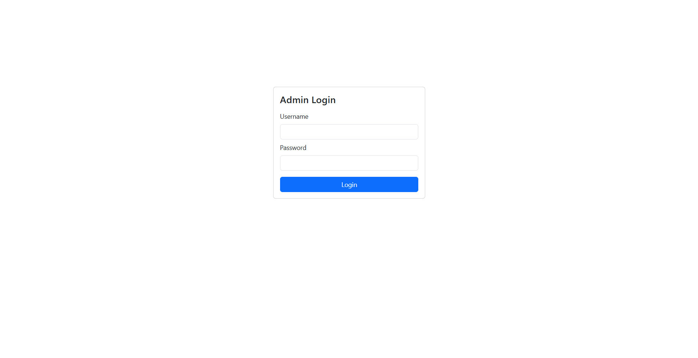<br />
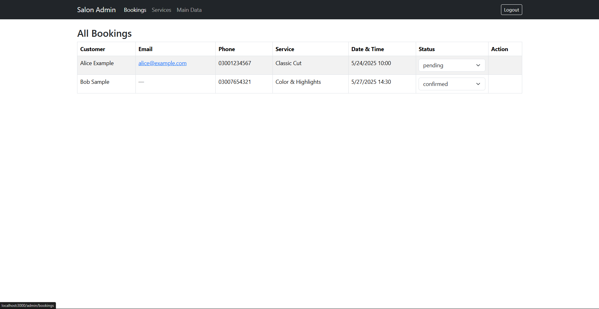<br />
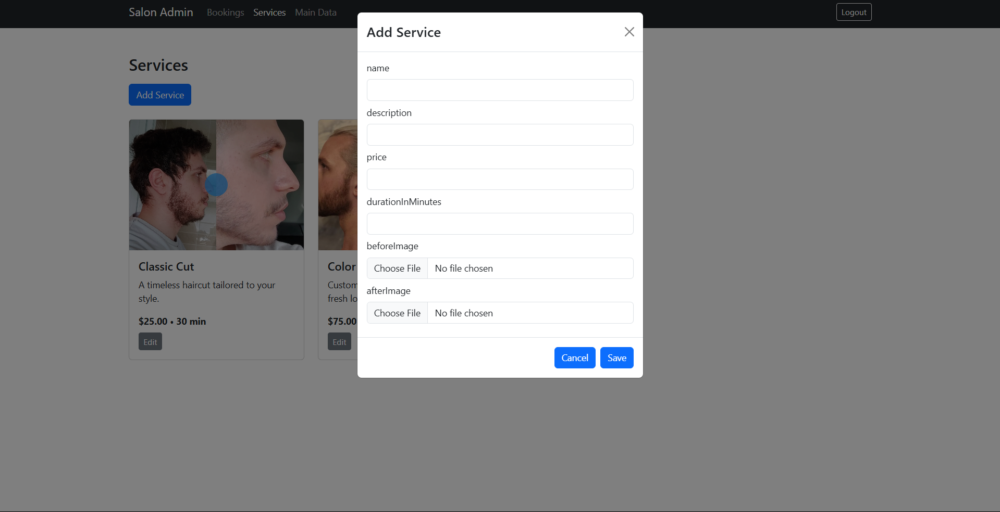<br />
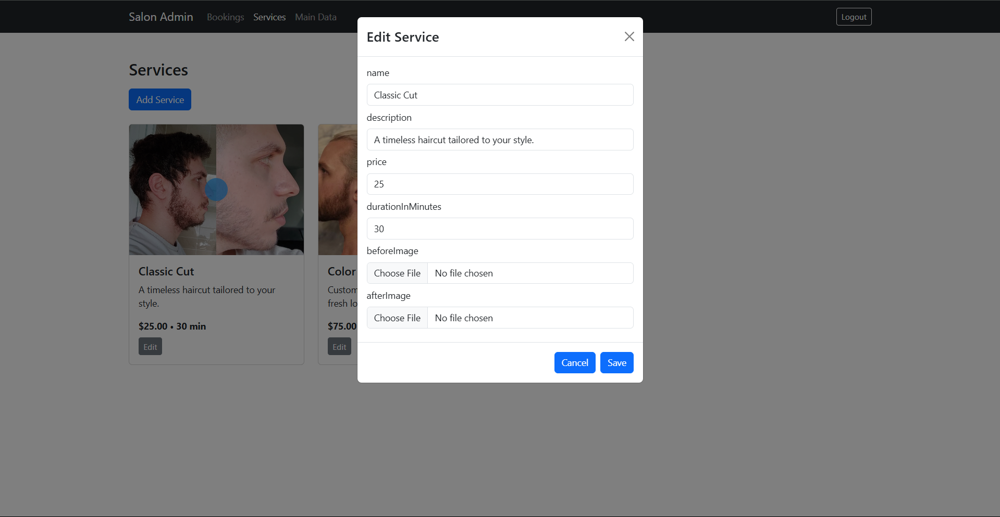<br />
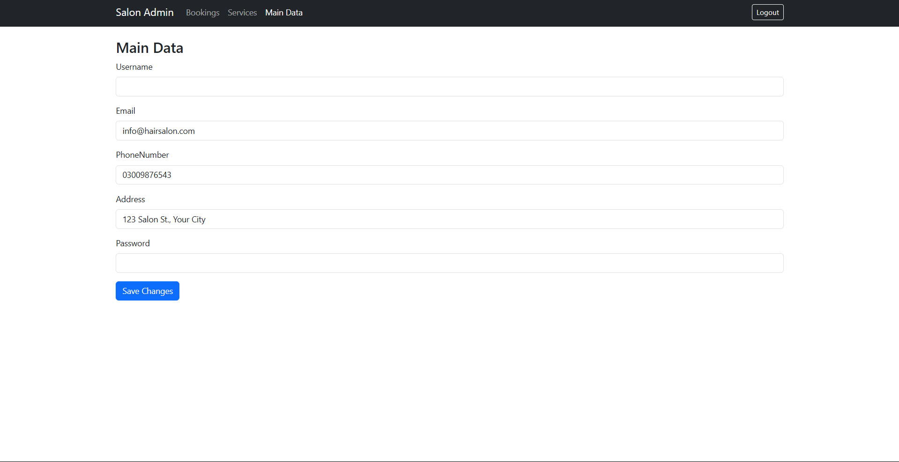<br />


---